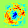
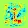
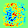
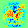

# Inverse basic Neural Network

Here is a little thing I had done in early 2017 to visualize what does a NN "learn" when classifying MNIST data.

### Initial set up

I trained the following basic NN using `tensorflow`:

$$ class = softmax(tanh(X*W1+b1)*W2+b2) $$

### Inversion method

Given a trained NN and a digit (0 ... 9), I freeze the value of the weights in the NN, and feed the neural net with a random image. Then, instead of backpropagating the gradient to the weights, it is the input image that get modified. This way the input image converges to the "ideal" representation of what the NN sees as a given digit.

### Results

The results were satisfactory and very explanatory :)

The color map is from blue to red (red is a highly probable line, blue is definitely not a line here)

I detail some relevant examples behind

#### Digit 0

We see the NN representation of a 0 is really good: line delimiting a hole! Quite smart

#### Digit 1

We see the NN detect a 1 if it has a vertical bar and sometime an horizontal too !

#### Digit 3

We can see 3 is really nice too!

#### Digit 4

4 is a bit messy, but there are many different ways of writing a 4 ... The NN only remember the common points: vertical bar on the right and horizontal in middle

